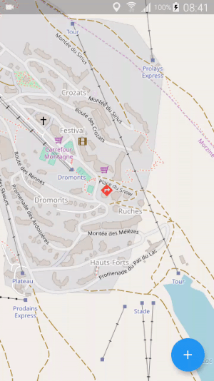
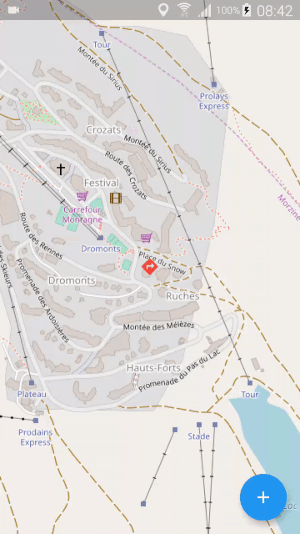

# Geodraw

Draw markers, lines and polygons on a map.

## Marker picker



```dart
import 'package:flutter/material.dart';
import 'package:geodraw/geodraw.dart';
import 'package:latlong/latlong.dart';

class MarkerPage extends StatelessWidget {
  @override
  Widget build(BuildContext context) {
    return MarkerPicker(
      callback: (BuildContext context, LatLng point) {
        print("Point: $point");
      },
    );
  }
}
```

## Line picker



```dart
import 'package:flutter/material.dart';
import 'package:geodraw/geodraw.dart';
import 'package:latlong/latlong.dart';

class LinePage extends StatelessWidget {
  @override
  Widget build(BuildContext context) {
    return LinePicker(
      callback: (BuildContext context, List<LatLng> points) {
        print("Line;");
        for (final point in points) {
          print("$point");
        }
      },
    );
  }
}
```

## Polygon picker


```dart
import 'package:flutter/material.dart';
import 'package:geodraw/geodraw.dart';
import 'package:latlong/latlong.dart';

class PolygonPage extends StatelessWidget {
  @override
  Widget build(BuildContext context) {
    return PolygonPicker(
      callback: (BuildContext context, List<LatLng> points) {
        print("Polygon;");
        for (final point in points) {
          print("$point");
        }
      },
    );
  }
}
```
